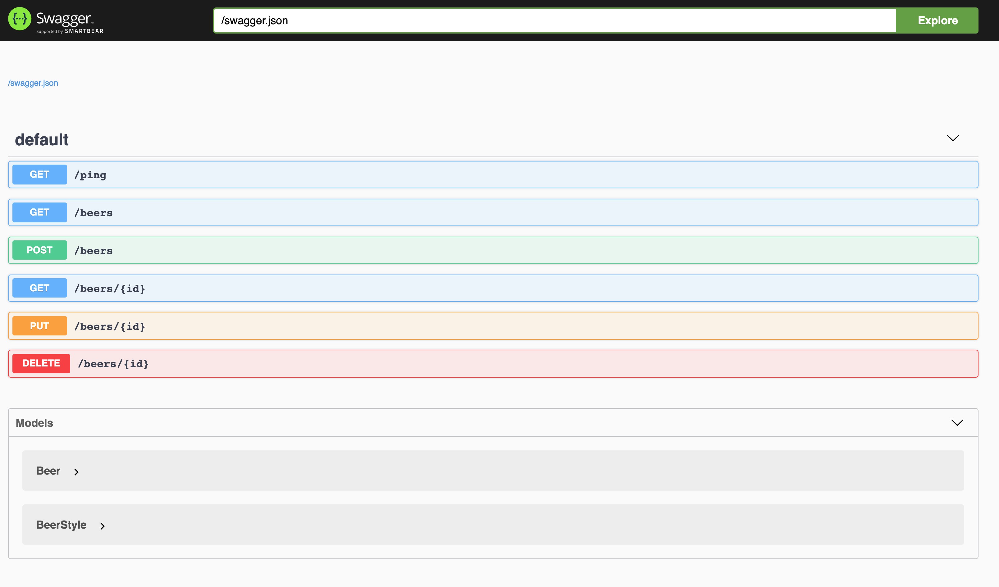

# Hask-Ale :beer:

## Language slides
https://juliendehos.gitlab.io/lillefp-2019-isomorphic/

## Pre-requisites

### Stack

Install `Haskell Tool Stack`, see [Haskell Tool Stack Installation](https://docs.haskellstack.org/en/stable/README/)

### LZMA Library

You may need to install manually the `lzma` library used by the `Swagger` library:

- Fedora: `sudo dnf install ghc-lzma-devel`
- macOs: `brew install xz`

### [macOs] Libz

For macOs users, you have to re-install `libz` properly following these steps: 

```
rm -f /usr/local/lib/libz*
brew install lzlib
```

## Few commands 

### Run the tests

```
stack test
```

You can add the `--file-watch` option to reload automatically the tests after each modification.

### Run the application

```
stack run
```

You should see the following message:

```
listening on port 3000
```

## Steps 

### Step 0 - Ping... pong

> "On boira du lait le jour où les vaches mangeront du houblon."

We already created a first endpoint to ping our server: **GET /ping** => Returns `"pong"`

Let's analyze what is going on in [Controller.hs](src/Controller.hs):

- Look at the `Ping` type

- Look at the `pingHandler` handler

- Look at the `server` (currently only serving the Ping API thanks to the handler)

Now run the server:
```sh
$ stack run
```

**Expected result:** 
```sh
$ curl http://localhost:3000/ping
Pong
```

Good job! You defined your first HTTP endpoint in Haskell with Servant! 

### Step 1 - Model to JSON (Aeson - encode)

> "Comment se protéger contre l'eau polluée ? En buvant de la bière." [Al Bud; humoriste écossais]

In [Model directory](src/Model), we have a simple model definition with a `Beer` and `BeerStyle` modules. 

We know we want to deal with this model as JSON as output so we have to define a way to encode these models to JSON. 

To do so, we are going to use the [Aeson](http://hackage.haskell.org/package/aeson) library which is already configured as a dependency to the project. 

Some tests are already defined to validate the implementation so your goal is to propose a way to get the model as encoded.

- First, you need to uncomment the **encoding tests** only (`test_encode**`) in [test/Model/BeerSpec.hs](test/Model/BeerSpec.hs): 
```haskell
test_encodeValidBeerWithoutAlcoholRate =
  testCase "When encoding a beer without alcohol rate, it returns a JSON" $
  encodePretty' encodePrettyOptions beerWithoutAlcoholRate @?= beerWithoutAlcoholRateAsJson

test_encodeValidBeerWithAlcoholRate =
  testCase "When encoding a beer with alcohol rate, it returns a JSON" $
  encodePretty' encodePrettyOptions beerWithAlcoholRate @?= beerWithAlcoholRateAsJson
```
- Run the tests: `stack test --file-watch` (this should not even compile)
- Then update [src/Model/Beer.hs](src/Model/Beer.hs) to fix the compilation and tests

Tip: `encode :: ToJSON a => a -> ByteString`

**Expected result:** the tests should pass.

### Step 2 - Get all beers!

> "Il n'y a pas que la bière dans la vie, mais elle améliore tout le reste..." [Stephen Morris; écrivain américain]

So now, how to get all the beers? 

In [src/Constants.hs](src/Constants.hs) there is a `beers` function which returns a list of beers we want to return when calling `GET /beers`.

- Create a `GetAllBeers` type and add it to a "ApplicationApi" type: 
```haskell
type GetAllBeers = "beers" :> Get '[ JSON] [Beer]

type ApplicationApi = Ping :<|> GetAllBeers
```
In this type, we get the previously created `Ping` and we define a new endpoint over `/beers` using the `Get` request. This return a JSON formatted list of `Beer`.

- Create the associated handler of the newly created endpoints:
```haskell
beersHandler :: AppContext [Beer]
beersHandler = ??
``` 
- Change server signature to: `server :: Server ApplicationApi` as now, it does not only handle the `ping` but the `ApplicationAPI`. 

- Update the code to get the compiler happy (you can combine handlers with `:<|>`). What happens if you change the order? Why?

- Run the application and open your browser to check `http://localhost:3000/beers`

**Expected result:** it should return the list of beers as a JSON array 

### Step 3 - Find the beer

> \- Moi mon truc, c'est de rajouter une petite goutte de bière quand j'ai battu les oeufs...  
> \- L'adresse, bordel ! [Le Dîner De Cons]

Let's get your favourite beer by its `identifier` now: `GET /beers/{searched_id}`

- Create the endpoint as a specific type like: `type FindBeerById = ...`
You will have to `Capture` the provided id in the path parameters. You can find documentation and example [here](https://hackage.haskell.org/package/servant-0.7.1/docs/Servant-API-Capture.html).

This endpoint may return a beer if it exists in the list. What should happen if there is no beer for the provided id?

- Create the associated handler function which will take the `searchedId` in parameter

Tip: if you wonder how to find the beer with the correct identifier in the list of `beers`, you can use [Hoogle](https://hoogle.haskell.org/?hoogle=%28a%20-%3E%20Bool%29%20-%3E%20%5Ba%5D%20-%3E%20Maybe%20a%20package%3Abase&scope=set:stackage) to look for a function by its signature!

- Add the endpoint to `ApplicationApi` and get the code compiling

**Expected result:**  If the beer exists, it should return it.

### Step 4 - JSON to Model (Aeson - decode)

> "L'homme ne meurt pas en vain, il meurt en bière." [Sandrine Fillassier]

In order to be able to create new beers, we need to define the way the beers will be decoded from JSON. 

- First, you need to uncomment the remaining tests in [test/Model/BeerSpec.hs](test/Model/BeerSpec.hs)
 
- Run the tests: `stack test --file-watch` (this should not even compile)

- Then update [src/Model/Beer.hs](src/Model/Beer.hs) to fix the compilation and tests

**Expected result:** the tests should pass.

### Step 5 - Draft your beer (`POST`)

> "Bien sûr que je suis de gauche ! Je mange de la choucroute et je bois de la bière." [Jacques Chirac]

So you'd like to draft your own beer. To do so, we will need to create it by requesting to `POST /beers` passing the beer as Json request body like below: 

```json
{
  "name": "Brewdog IPA",
  "alcohol": 5.4,
  "style": "INDIA_PALE_ALE"
}
```

- First, you need to create the endpoint as before: 
    - You will need to provide a request body as Json of Beer model (`ReqBody '[ JSON] Beer`)
    - The request will return nothing so you can use `PostNoContent` and `NoContent` as payload
    
- Then you can add this new endpoint to the `ApplicationApi` definition to expose it 

- You will have to fix the compilation issue as there is no handler for this new endpoint so you need to create it
    - It will take the beer as parameter
    - It will return `NoContent`

The handler will have to deal with saving the provided beer. To do so, you can use: `key <- insert (toRow beer)` which will return the key of the saved entity so you can bind it to a variable (remember the `do` notation from the Haskell language introduction!).

You can then use `liftIO (putStrLn ("Saved beer " ++ show beer ++ " with key = " ++ show key))` to log the saved beer to the console.

- What happens if you try to create a malformed Json document? 

**Expected result:** When creating a Beer as following, it should work. 
```
$ curl --request POST \
   --url http://localhost:3000/beers \
   --header 'content-type: application/json' \
   --data '{
   "alcohol": 5.4,
   "name": "Brewdog IPA",
   "style": "INDIA_PALE_ALE"
 }'
```

### Step 6 - Get all the beers again!

> "Ce n'est pas parce que la bière coule à flots que vous devez vous y noyer." [Jacques Caron - Retraité]

Now we persist beers in a memory DB, we can refactor the handler which returns all the beers so it fetches them form the DB instead of [src/Constants.hs](src/Constants.hs).  

You can use the following statement to retrieve all the `Beers` from the database. 
```haskell
do
  beersFromDB :: [Entity BeerRow] <- selectList [] []
  ... 
```
Note that `selectList` takes 2 parameters: 
- a list of filters (= `where` clauses)
- a list of `SelectOps` (like `limit`)

Then, you need to transform this list of `Entity BeerRow` to a list of `Beer` so you can use function `DatabaseStuff#fromRow`: 
```haskell
fromRow :: Entity BeerRow -> Beer
```

Tip: use `fmap` to iterate over `[Entity BeerRow]` so you can apply the transformation.

**Expected result:** After creating some beers, requesting all should return all of them:
```
$ curl --request GET --url http://localhost:3000/beers
[{"style":"INDIA_PALE_ALE","alcohol":5.4,"name":"Brewdog IPA","identifier":1},{"style":"AMBER_ALE","alcohol":10,"name":"Trappe Quadrupel","identifier":2}]
```

**Bonus:** Refactor `beerByIdHandler` as well 

### Step 7 - Pimp it (`PUT`)

> "Celui qui boit de la bière, il s'endort vite; celui qui dort longtemps ne pèche pas; Celui qui ne pèche pas entre au Ciel! Ainsi, buvons de la bière!" [Martin Luther - Moine, Religieux, Scientifique, Théologien (1483 - 1546)]

You can now create and find beers but how would we update a beer?

- Create a `PUT /beers/{$beerId}` endpoint with `Beer` as a Json payload

- As before, add this endpoint to `ApplicationApi` and create the handler so it will update the beer in database whose id is the provided `beerId` from the path. You can use function `replace` from persistent: 
```haskell
replace :: Key BeerRow -> BeerRow -> AppContext ()
```

Tip: use `toSqlKey` to transform beer id to `Key BeerRow`

**Expected result:** After creating a beer, try updating its name and get all beers to check it has been updated.

Bonus: This function will not fail if the record does not exist. What can you do to return HTTP 404 when we try to update a beer which does not exist?  

### Step 8 - Drink it (`DELETE`)

> "Je suis un buveur occasionnel, le genre de type qui sort boire une bière et qui se réveille à Singapour avec une barbe." [Raymond Chandler]

When you drink a beer, it should be deleted from the database. 

- Create a `DELETE /beers/{$beerId}` endpoint without any request body

- As before, add this endpoint to `ApplicationApi` and create the handler so it will delete the beer in database whose id is the provided `beerId` from the path. You can use function `delete` from Persistent: 
```haskell
delete :: Key BeerRow -> AppContext ()
```

Tip: you will need to explicitly define the provided key as a `Key BeerRow`.  

**Expected result:** After creating a beer, call the deletion endpoint providing the created beer id and check it no longer exists. 

Bonus: This function will not fail if the record does not exist. What can you do to return HTTP 404 when we try to delete a beer which does not exist?  

### Step 9 - Swagg'it (Swagger)

> "Bière qui mousse amasse la foule." [Claude Frisoni - Artiste, écrivain (1954 - )]

We created a model and some endpoints to deal with it. Let's add Swagger to expose them.

In [src/Application.hs](src/Application.hs):
- Create the SwaggerUI type to use `SwaggerSchemaUI`:
```haskell
-- | Servant type for the Swagger endpoints (UI and JSON)
type SwaggerUI = SwaggerSchemaUI "swagger-ui" "swagger.json"
```
- Create a new type to define `ApplicationApi` with the `SwaggerUI` as below: 
```haskell
type ApiWithSwagger = SwaggerUI :<|> ApplicationApi
``` 
- The function building the application (`Application.hs#application`) will use this new proxy to use SwaggerUI: 
```haskell
-- Before
application sqlBackend = serve proxyAPI (hoistAppServer sqlBackend) 
-- After 
application sqlBackend = serve proxyAPI (swaggerServer :<|> hoistAppServer sqlBackend)
```
It should no longer compile because the proxy is of type `Proxy ApplicationApi` but it expects a proxy of type `Proxy ApiWithSwagger`.
- Define a new `proxyAPIWithSwagger` using this new type: 
```haskell
proxyAPIWithSwagger :: Proxy ApiWithSwagger
proxyAPIWithSwagger = Proxy
```
Now use this new proxy in the `application` function.
- The function returning a Server SwaggerUI can be defined as below: 
```haskell
swaggerServer :: Server SwaggerUI
swaggerServer = swaggerSchemaUIServer swaggerDoc
```
`swaggerSchemaUIServer` expects a `Swagger` so let's create one!
```haskell
swaggerDoc :: Swagger
swaggerDoc = toSwagger (Proxy :: Proxy ApplicationApi)
```
- Finally, you need to make sure the `Model` can be used in Schema (use `ToSchema` from `schema` library).
 
**Expected result:** Run the application and go to `localhost:3000/swagger-ui` and you should see the expected UI: 
 

**Bonus:** You can customize / enrich the swagger documentation defining a function as below: 
```haskell
-- Add generic Swagger configuration like the title, description, etc.
enrichSwagger :: Swagger -> Swagger

-- And call this function 
swaggerDoc :: Swagger
swaggerDoc = enrichSwagger $ toSwagger (Proxy :: Proxy ApplicationApi)
```
